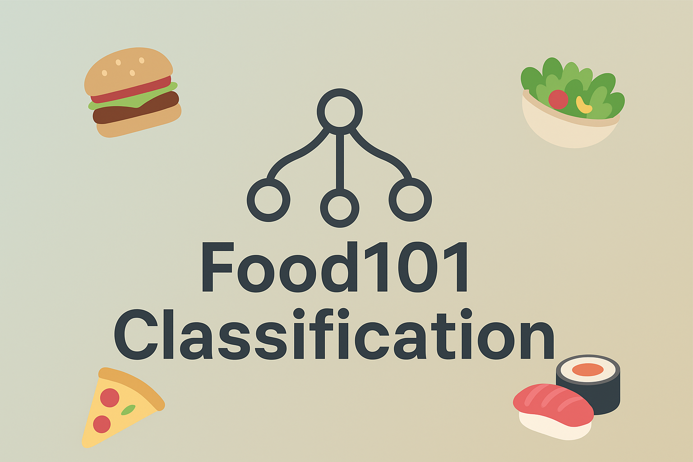

[](https://www.python.org/)[](https://pytorch.org/)[](LICENSE)

# 🍽️ Food-101 Image Classification with EfficientNetV2-S and PyTorch Lightning

This repository contains the code for an end-to-end deep learning project to classify 101 food categories from the challenging Food-101 dataset. The project demonstrates a systematic approach to model selection, fine-tuning, and hyperparameter optimization, achieving a final validation accuracy of **85.4%** on the full dataset.

The entire training and evaluation pipeline is built using modern, reproducible practices with PyTorch Lightning.

---

## 📑 Table of Contents

- [🍽️ Food-101 Image Classification with EfficientNetV2-S and PyTorch Lightning](#️-food-101-image-classification-with-efficientnetv2-s-and-pytorch-lightning)
  - [📑 Table of Contents](#-table-of-contents)
  - [🎯 Project Highlights](#-project-highlights)
  - [💡 Real-World Applications](#-real-world-applications)
  - [🧫 Experimental Results](#-experimental-results)
  - [📊 Final Results](#-final-results)
  - [🔬 Performance Analysis and Error Diagnosis](#-performance-analysis-and-error-diagnosis)
      - [🍤 Lowest-Performing Classes](#-lowest-performing-classes)
      - [🔎 Root Cause Analysis of Misclassifications](#-root-cause-analysis-of-misclassifications)
      - [🛠️ FutureWork](#️-futurework)
  - [🧪 Methodology and Experimental Process](#-methodology-and-experimental-process)
  - [📁 Repository Structure](#-repository-structure)
  - [🚀 Getting Started](#-getting-started)
    - [Prerequisites](#prerequisites)
    - [Installation](#installation)
    - [Usage](#usage)
    - [💻 Technologies Used](#-technologies-used)

---

## 🎯 Project Highlights

- **High-Performance Model** ⚡: Utilizes a pre-trained `EfficientNetV2-S`, selected for its excellent balance of accuracy and computational efficiency suitable for potential edge deployment.
- **Reproducible Pipeline** 🔄: Encapsulates the entire workflow—from data loading to training and evaluation—in a clean and organized `LightningModule` and `DataModule`.
- **Efficient Experimentation** ⏱️: Overcame hardware limitations by implementing dataset subsetting for rapid prototyping.
- **Advanced Fine-Tuning** 🛠️: Implemented a robust fine-tuning strategy, unfreezing the final three blocks of the feature extractor and using the `Adam` optimizer with a `CosineAnnealingLR` scheduler for stable convergence.
- **In-Depth Analysis** 🔎: Went beyond simple accuracy by calculating and logging per-class F1-scores and accuracies, enabling a deep dive into the model's strengths and weaknesses.
- **Live Deployment** 📺: The final model is deployed and accessible as an interactive Gradio web application on Hugging Face Spaces.

---

## 💡 Real-World Applications

Beyond being a technical challenge, this food classification model serves as a foundation for numerous real-world applications in health, hospitality, and smart home technology.

- **Health and Nutrition Tracking**
  - **Automated Calorie Counting:** Users can snap a photo of their meal, and an app can automatically identify each food item to provide an instant estimate of calories, macros, and other nutritional information.
  - **Dietary Management:** Assists individuals with allergies or specific dietary needs (e.g., diabetes, gluten-free) by helping them identify and log their food intake accurately.
- **Restaurant and Hospitality Tech**
  - **Self-Checkout Systems:** In cafeterias or quick-service restaurants, a camera-based system could identify all items on a tray to automate the billing process, reducing queues and improving efficiency.
    - **Interactive Menus:** Allow diners to point their phone at a dish to get more information, such as ingredients, allergen warnings, or customer reviews.

- **Smart Home and Appliances**
  - **Smart Refrigerators:** A fridge equipped with a camera could identify leftover dishes, suggest recipes based on available food, and help track food spoilage to reduce waste.

---

## 🧫 Experimental Results

This project followed an iterative approach. The table below summarizes the key experiments and their outcomes, showing the progression from the initial baseline to the final model.

| Model | Training Strategy | Data % | Key Hyperparameters | Final Val Accuracy |
| :--- | :--- | :--- | :--- | :--- |
| `EfficientNet-B2` | Simple fine-tune (last block) | 50% | `lr=1e-4` | ~64% |
| `EfficientNet-B2` | Unfreeze last 3 blocks | 50% | `lr=1e-3` | 82.0% |
| `EfficientNet-B2` | Two-Stage Fine-Tuning | 50% | `lr1=1e-3`, `lr2=1e-5` | Performance Degraded |
| **`EfficientNetV2-S`** | Unfreeze last 3 blocks | 50% | `lr=1e-4` (Tuned) | 82.4% |
| **`EfficientNetV2-S`** | Unfreeze last 3 blocks and more advanced transforms | 50% | `lr=1e-4` (Tuned) | ~82.4% Pretty much the same Performance|
| **`EfficientNetV2-S`** | **Unfreeze last 3 blocks** | **100%** | **`lr=1e-4` (Tuned)** | **85.4%** |

---

## 📊 Final Results

After systematically iterating on model architecture and hyperparameters, the final model achieved the following performance on the full Food-101 validation set:

| Metric              | Score   |
| :------------------ | :------ |
| Validation Accuracy | **85.4%** |


*A confusion matrix visualization helps diagnose the model's performance on a per-class basis. (Replace with your own plot)*

This model is deployed and accessible as an interactive Gradio web application on Hugging Face Spaces.


Check out my [Food101 Gradio Demo](https://huggingface.co/spaces/Deathshot78/Food101-Classification).

---

## 🔬 Performance Analysis and Error Diagnosis

Beyond the aggregate accuracy, a per-class analysis was conducted to identify the model's specific limitations and diagnose the root causes of misclassifications.

The model performed exceptionally well on many classes but struggled with a distinct set of categories, primarily due to visual ambiguity and high variability in appearance.

#### 🍤 Lowest-Performing Classes

The following five classes had the lowest validation accuracy:

| Class Name          | Index | Validation Accuracy |
| :------------------ | :---- | :------------------ |
| `shrimp_and_grits`  | 93    | 44.0%               |
| `ravioli`           | 77    | 59.2%               |
| `apple_pie`         | 0     | 61.6%               |
| `huevos_rancheros`  | 56    | 63.2%               |
| `falafel`           | 36    | 63.6%               |

#### 🔎 Root Cause Analysis of Misclassifications

- **High Intra-Class Variation**: The model struggled with dishes that have no single, consistent appearance.  
- **Fine-Grained Confusion**: Errors occurred between visually similar classes like `ravioli` vs. `dumplings`.  
- **Ambiguous Features**: Foods like `falafel` resemble many small fried dishes, making classification tricky.  

#### 🛠️ FutureWork

Improvements could include:

- Detailed confusion matrix analysis 🔍
- More aggressive data augmentation 📈  
- Larger architectures for fine-grained recognition 🏋️  
- Training for longer 🏋️

---

## 🧪 Methodology and Experimental Process

Steps taken in the project:

1. **Baseline Establishment** 🏁 – EfficientNet-B2 achieved ~64%.  
2. **Architecture Selection** 🏗️ – EfficientNetV2-S chosen for balance of accuracy and size.  
3. **Transforms Selection** 🎨 – TrivialAugmentWide + RandomResizedCrop, RandAugment, etc.  
4. **Fine-Tuning Strategy** 🔧 – Final 3 blocks unfrozen for training.  
5. **Final Model Training** 🏆 – Full dataset, Adam, CosineAnnealingLR, EarlyStopping → 85.4%.  

---

## 📁 Repository Structure

```bash
food-101-classification/
├── data/
├── logs/
├── scripts/
│   ├── main.py
│   ├── models.py
│   ├── class_names.py
│   ├── app.py
│   └── prepare_data.py
├── .gitignore
├── requirements.txt
└── README.md
```

---

## 🚀 Getting Started

### Prerequisites

- Python 3.10+ 🐍
- PyTorch 🔥
- CUDA-enabled GPU (recommended) 🎮

### Installation

1. **Clone the repository:**

    ```bash
    git clone https://github.com/Deathshot78/Food101-Classification
    cd Food101-Classification
    ```

2. **Install the dependencies:**

    ```bash
    pip install -r requirements.txt
    ```

### Usage

Run training with a subset for quick testing:

```bash
python main.py
```

---

### 💻 Technologies Used

- Python

- PyTorch

- PyTorch Lightning

- TorchMetrics

- Gradio

- Matplotlib & Seaborn
  